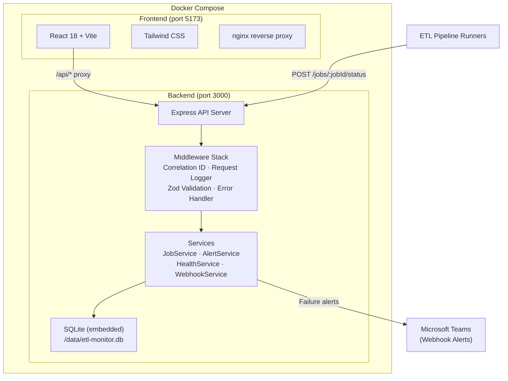
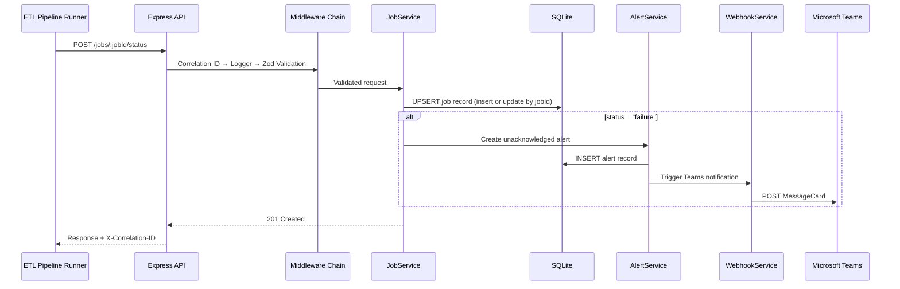
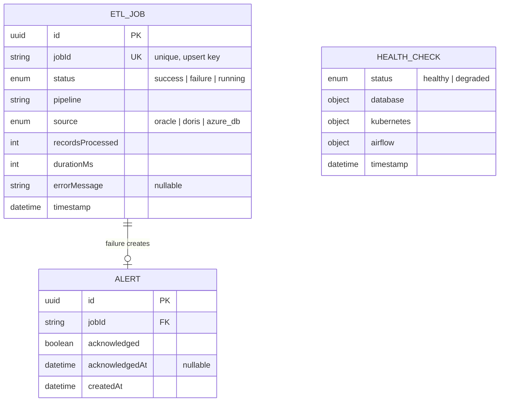
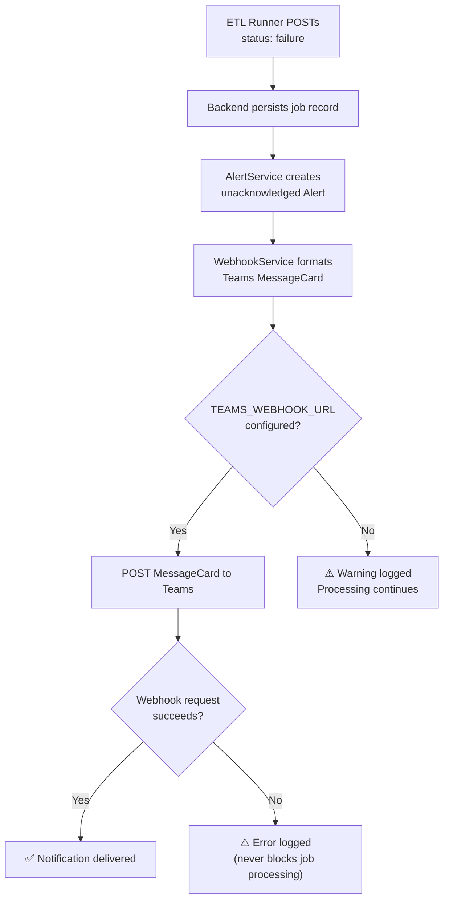
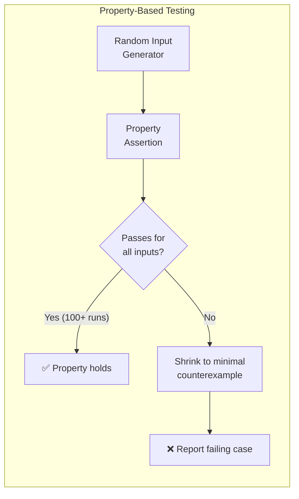
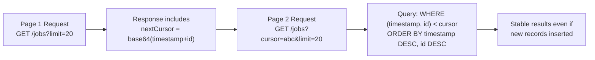
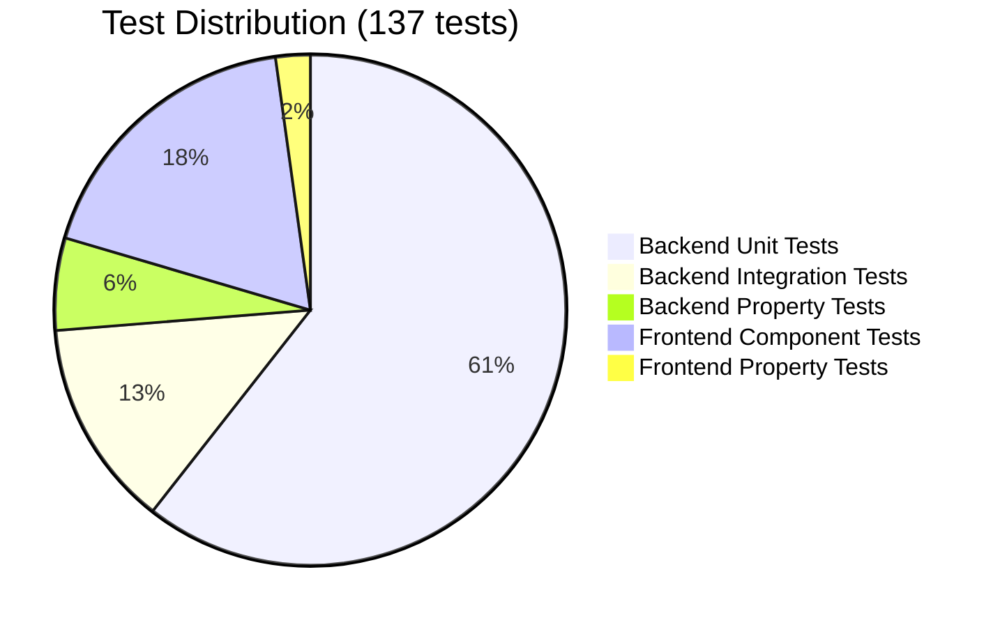

# Smith Farms ETL Monitor

A full-stack monitoring system for the Smith Farms agricultural supply chain ETL pipelines. Tracks job executions across Oracle, DORIS, and Azure DB data sources, provides real-time health checks, failure alerting via Microsoft Teams, and a React dashboard for operational visibility.

---

## Architecture Overview



### Request Flow



### Technology Stack

| Layer | Technology | Purpose |
|-------|-----------|---------|
| **Frontend** | React 18, Vite, Tailwind CSS | SPA dashboard for job monitoring |
| **Frontend Serving** | nginx | Static file serving + API reverse proxy |
| **Backend Runtime** | Node.js 20, Express, TypeScript | REST API server |
| **Validation** | Zod | Request schema validation |
| **Database** | SQLite via Knex.js | Embedded persistence (swappable to PostgreSQL/Azure SQL) |
| **Logging** | Pino | Structured JSON logging with correlation IDs |
| **Alerting** | Microsoft Teams Webhooks | MessageCard notifications for ETL failures |
| **Testing** | Vitest, Supertest, React Testing Library, fast-check | Unit, integration, and property-based testing |
| **Containerization** | Docker, Docker Compose | Single-command deployment |

---

## Setup and Run Instructions

### Prerequisites

- Node.js 20+
- npm 9+
- Docker and Docker Compose (for containerized setup)

### Option 1: Docker (Recommended)

Start the full application with a single command. The backend automatically runs database migrations and seeds 55 demo records on first startup.

```bash
docker-compose up --build
```

| Service | URL |
|---------|-----|
| Frontend | http://localhost:5173 |
| Backend API | http://localhost:3000 |

To configure Teams webhook notifications:

```bash
TEAMS_WEBHOOK_URL=https://your-webhook-url docker-compose up --build
```

### Option 2: Manual Setup

**Backend:**

```bash
cd backend
npm install
npm run seed      # Run migrations + seed 55 demo records
npm run dev       # Start dev server on port 3000
```

**Frontend (in a separate terminal):**

```bash
cd frontend
npm install
npm run dev       # Start Vite dev server on port 5173
```

### Environment Variables

| Variable | Default | Description |
|----------|---------|-------------|
| `PORT` | `3000` | Backend API server port |
| `DATABASE_PATH` | `./data/etl-monitor.db` | SQLite database file path |
| `TEAMS_WEBHOOK_URL` | *(empty)* | Microsoft Teams incoming webhook URL (optional) |

---

## Data Model

### Entity Relationship Diagram



### ETL_Job

| Field | Type | Description |
|-------|------|-------------|
| `id` | UUID | Internal primary key |
| `jobId` | string | External job identifier (unique key). Repeated POSTs for the same `jobId` update the existing record (upsert semantics), reflecting the latest execution state. |
| `status` | enum | `success`, `failure`, or `running` |
| `pipeline` | string | Pipeline name (e.g., `oracle-inventory-sync`) |
| `source` | enum | `oracle`, `doris`, or `azure_db` |
| `recordsProcessed` | integer | Number of records processed |
| `durationMs` | integer | Execution duration in milliseconds |
| `errorMessage` | string? | Error details (nullable, relevant for failures) |
| `timestamp` | ISO 8601 | Server-generated timestamp |

### Alert

| Field | Type | Description |
|-------|------|-------------|
| `id` | UUID | Primary key |
| `jobId` | string | References the failed ETL job |
| `acknowledged` | boolean | Whether an operator has acknowledged the alert |
| `acknowledgedAt` | ISO 8601? | Timestamp of acknowledgment (nullable) |
| `createdAt` | ISO 8601 | Alert creation timestamp |

### Health_Check

| Field | Type | Description |
|-------|------|-------------|
| `status` | enum | `healthy` (all components OK) or `degraded` (any component unhealthy) |
| `components.database` | object | Real SQLite connectivity check |
| `components.kubernetes` | object | Kubernetes pod status (simulated adapter) |
| `components.airflow` | object | Airflow scheduler status (simulated adapter) |
| `timestamp` | ISO 8601 | Health check timestamp |

### Seed Data Distribution

| Pipeline | Source | Count | Status Mix |
|----------|--------|-------|------------|
| `oracle-inventory-sync` | oracle | ~10 | 70% success, 20% failure, 10% running |
| `oracle-supplier-feed` | oracle | ~9 | 70% success, 20% failure, 10% running |
| `doris-sales-etl` | doris | ~9 | 70% success, 20% failure, 10% running |
| `doris-warehouse-metrics` | doris | ~9 | 70% success, 20% failure, 10% running |
| `azure-reporting-load` | azure_db | ~9 | 70% success, 20% failure, 10% running |
| `azure-customer-sync` | azure_db | ~9 | 70% success, 20% failure, 10% running |
| **Total** | | **55 records** | Spread across 7 days |

---

## Alerting and Monitoring

### Failure Detection Flow



### MessageCard Contents

| Field | Source | Example |
|-------|--------|---------|
| Job ID | Request parameter | `oracle-inv-2025-01-15-001` |
| Pipeline | Request body | `oracle-inventory-sync` |
| Data Source | Request body | `oracle` |
| Error Message | Request body | `Connection timeout to Oracle DB` |
| Duration (ms) | Request body | `45230` |
| Timestamp | Server-generated | `2025-01-15T03:22:41Z` |

### Alert Acknowledgment

Operators acknowledge alerts via `POST /alerts/acknowledge/:alertId`, which records the acknowledgment timestamp. The dashboard displays visual indicators for unacknowledged failure alerts. Re-acknowledging an already-acknowledged alert returns a `409 Conflict`.

---

## API Endpoints

| Method | Path | Description | Request Body |
|--------|------|-------------|-------------|
| `POST` | `/jobs/:jobId/status` | Report ETL job execution status (upsert: creates or updates) | `{ status, pipeline, source, recordsProcessed, durationMs, errorMessage? }` |
| `GET` | `/jobs` | List jobs (paginated, filterable) | Query: `?status=&pipeline=&cursor=&limit=&from=&to=` |
| `GET` | `/jobs/:jobId` | Get job details | — |
| `GET` | `/health` | Aggregate health check | — |
| `POST` | `/alerts/acknowledge/:alertId` | Acknowledge a failure alert | — |
| `POST` | `/webhooks/teams/test` | Local webhook testing endpoint | Teams MessageCard payload |

---

## Chosen Advanced Feature: Microsoft Teams Webhook Integration

The chosen advanced feature is Microsoft Teams webhook integration for automated failure alerting. When any ETL pipeline reports a `status: "failure"`, the system automatically:

1. Creates an unacknowledged alert record in the database
2. Formats a MessageCard with job details (pipeline, source, error message, duration)
3. POSTs the MessageCard to the configured Teams channel webhook

The integration is designed to be resilient: webhook failures are logged but never block job processing. A local test endpoint (`POST /webhooks/teams/test`) is available for development and verification without a real Teams channel.

To enable: set the `TEAMS_WEBHOOK_URL` environment variable to a valid Microsoft Teams incoming webhook URL.

---

## Advanced Features

### Property-Based Testing with fast-check

The project uses [fast-check](https://github.com/dubzzz/fast-check) for property-based testing alongside traditional unit and integration tests. Property tests generate hundreds of random inputs to verify universal correctness properties.



| Suite | Properties | Min Iterations | Examples |
|-------|-----------|----------------|----------|
| **Backend** | 8 | 100 each | Job round-trip consistency, invalid enum rejection, failure-alert creation, pagination completeness, health aggregation, correlation ID propagation |
| **Frontend** | 3 | 100 each | Job status visual indicators, unacknowledged alert indicators, health overview rendering |

### Cursor-Based Pagination

Job listing uses cursor-based pagination instead of offset-based pagination. The cursor encodes the last seen job's `timestamp` and `id` as a base64url JSON string. This avoids issues with offset pagination when records are inserted or deleted between page requests, ensuring consistent results.



### Structured Observability

| Feature | Implementation | Benefit |
|---------|---------------|---------|
| **Correlation IDs** | `X-Correlation-ID` header (UUIDv4), generated or propagated | Distributed tracing across request lifecycle |
| **Structured Logging** | Pino JSON logs with timestamp, level, message, correlation ID | Machine-parseable, searchable in Log Analytics |
| **Request Logging** | Middleware logs method, path, status, duration per request | Performance monitoring and debugging |

### Microsoft Teams Webhook Integration

ETL job failures trigger formatted `MessageCard` notifications to a configured Microsoft Teams channel. The integration is resilient — webhook failures are logged but never block job processing. A local test endpoint (`POST /webhooks/teams/test`) is available for development.

---

## Testing Summary



| Category | Count | Framework | What's Tested |
|----------|-------|-----------|---------------|
| Backend unit tests | 83 | Vitest | Service logic (jobService, alertService, healthService, webhookService), Zod validation (26 schema tests), middleware behavior, DB connection |
| Backend integration tests | 18 | Vitest + Supertest | Full HTTP request/response cycles for jobs, health, alerts, and webhooks endpoints |
| Backend property tests | 8 | Vitest + fast-check | Job round-trip consistency, invalid enum rejection, failure-alert creation, pagination completeness, health aggregation, correlation ID propagation |
| Frontend component tests | 25 | Vitest + React Testing Library | JobList, JobFilters, JobDetail, HealthOverview rendering and interaction |
| Frontend property tests | 3 | Vitest + fast-check | Job status visual indicators, unacknowledged alert indicators, health overview rendering |

### Running Tests

```bash
# All tests (backend + frontend)
npm test

# Backend only
npm run test:backend

# Frontend only
npm run test:frontend

# Backend subsets
cd backend
npm run test:unit
npm run test:integration
npm run test:property

# Frontend subsets
cd frontend
npm run test:unit
npm run test:property
```

---

## Project Structure

```
smith-farms-etl-monitor/
├── backend/
│   ├── src/
│   │   ├── index.ts              # Server entry point
│   │   ├── app.ts                # Express app + middleware wiring
│   │   ├── config.ts             # Environment configuration
│   │   ├── logger.ts             # Pino structured logger
│   │   ├── types.ts              # Shared TypeScript interfaces
│   │   ├── db/
│   │   │   ├── connection.ts     # Knex + SQLite connection
│   │   │   ├── migrations/       # Database schema migrations
│   │   │   └── seed.ts           # Demo data seed script
│   │   ├── middleware/           # correlationId, requestLogger, validate, errorHandler
│   │   ├── routes/               # jobs, health, alerts, webhooks
│   │   └── services/             # jobService, alertService, healthService, webhookService
│   └── tests/                    # unit/, integration/, property/
├── frontend/
│   ├── src/
│   │   ├── App.tsx               # Root component + routing
│   │   ├── api/client.ts         # Axios instance with correlation ID interceptor
│   │   ├── components/           # JobList, JobDetail, JobFilters, HealthOverview, DashboardCharts, AlertBadge, Pagination, etc.
│   │   ├── hooks/                # useJobs, useJobDetail, useHealth
│   │   └── types.ts              # Frontend TypeScript interfaces
│   └── tests/                    # components/, property/
├── docs/                         # Infrastructure design + engineering reasoning
├── infra/                        # Terraform IaC + Kubernetes manifests
│   ├── main.tf                   # Root module — orchestrates all Azure resources
│   ├── modules/                  # network, aks, database, keyvault, monitoring, acr
│   └── k8s/                      # Kubernetes deployment manifests, network policies
├── docker-compose.yml
└── README.md
```

---

## Infrastructure as Code (Terraform)

The `infra/` directory contains Terraform modules that provision the Azure resources described in the infrastructure design document (`docs/part1-infrastructure-design.md`). This codifies the conceptual architecture into deployable infrastructure.

| Module | Resources | Maps to Design Doc Section |
|--------|-----------|---------------------------|
| `network` | VNet (10.0.0.0/16), 3 subnets, NSGs | Network Topology & Security Zones |
| `aks` | AKS cluster, system + app node pools, auto-scaling | Kubernetes Hardening |
| `database` | Azure SQL + geo-replication failover group | Database Redundancy & Failover |
| `keyvault` | Key Vault with RBAC, secrets via CSI driver | Security — Secrets Management |
| `monitoring` | Log Analytics, diagnostic settings, alert rules | Monitoring & Alerting |
| `acr` | Container Registry with managed identity pull | Azure Services |

Kubernetes manifests in `infra/k8s/` define the application deployment with resource limits, health probes, HPA, PodDisruptionBudgets, and Calico network policies — all matching the design doc specifications.

See [`infra/README.md`](infra/README.md) for setup instructions.

---

## Scope and Limitations

This implementation is scoped as an assessment deliverable. The following decisions are intentional trade-offs to keep the project self-contained and easy to review locally. The production Smith Farms environment is addressed separately in the infrastructure design document (`docs/part1-infrastructure-design.md`).

| Decision | Rationale | Production Path |
|----------|-----------|-----------------|
| **SQLite** | Embedded file-based DB eliminates setup friction for reviewers; no external DB server needed | Swap to PostgreSQL or Azure SQL via Knex.js config change |
| **Simulated K8s & Airflow health** | Adapter pattern with simulated responses; no real cluster required locally | Plug in real Kubernetes API and Airflow REST API checks |
| **Synthetic seed data** | 55 records with realistic distributions (70/20/10 status split across 6 pipelines) | Replace with real ETL pipeline integrations |
| **Single-node Docker Compose** | One-command local setup for reviewers | Deploy as separate AKS pods with horizontal scaling and load balancing |
| **No authentication** | API and dashboard are open for easy local testing | Secure via Azure AD / OAuth 2.0 |
| **Teams webhook optional** | Logs warning if URL not set; local test endpoint available for verification | Configure real Power Automate or Teams webhook URL in production |
| **No real-time updates** | Dashboard fetches data on user interaction (page load, filter change) | Add WebSocket or Server-Sent Events for live streaming |
| **Upsert job semantics** | `POST /jobs/:jobId/status` creates or updates a job record by `jobId`, reflecting the latest execution state | Matches ETL runner patterns where a pipeline re-reports status as it progresses |