# Part 1 — Infrastructure Hardening & Redundancy Design

## Smith Farms Agricultural Supply Chain Platform

---

## Table of Contents

1. [High-Level Architecture](#high-level-architecture)
2. [Azure Services & Justification](#azure-services--justification)
3. [Database Redundancy & Failover](#database-redundancy--failover)
4. [Automated Backup & Recovery Strategy](#automated-backup--recovery-strategy)
5. [Monitoring & Alerting](#monitoring--alerting)
6. [Kubernetes Hardening](#kubernetes-hardening)
7. [Azure VDI Session Pooling & Cost Optimization](#azure-vdi-session-pooling--cost-optimization)
8. [ETL Resilience](#etl-resilience)
9. [Security](#security)
10. [Disaster Recovery Plan](#disaster-recovery-plan)
11. [Key Tradeoffs & Assumptions](#key-tradeoffs--assumptions)

---

## High-Level Architecture

The platform runs on Azure (West US 2 primary, East US 2 DR) with AKS orchestrating the application tier, Oracle Data Guard providing ERP database resilience, and a dual-stack monitoring approach combining Prometheus and Azure Monitor.

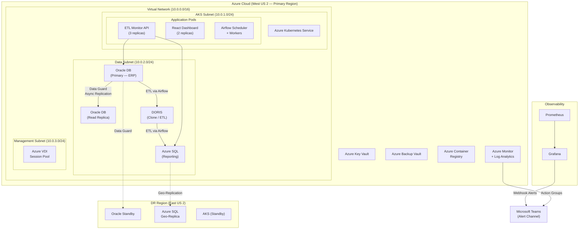

### Network Topology & Security Zones

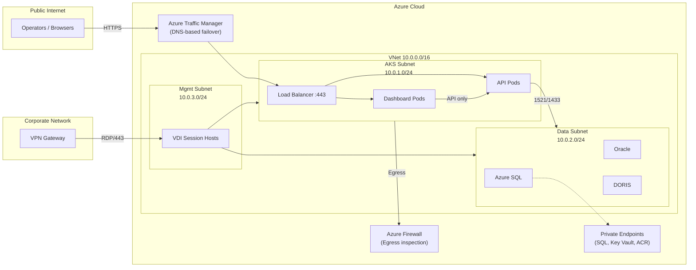

---

## Azure Services & Justification

| Service | Purpose | Justification |
|---------|---------|---------------|
| **Azure Kubernetes Service (AKS)** | Container orchestration for API, dashboard, and Airflow | Managed K8s reduces operational overhead; supports auto-scaling, rolling deployments, and self-healing. Smith Farms already runs on Kubernetes. |
| **Azure SQL Database** | Reporting layer (ETL target) | Managed service with built-in geo-replication, automated backups, and point-in-time restore. Eliminates DBA overhead for the reporting tier. |
| **Azure Key Vault** | Secrets management | Centralized storage for database credentials, webhook URLs, API keys. Integrates natively with AKS via CSI driver — pods mount secrets as volumes without embedding them in config. |
| **Azure Monitor + Log Analytics** | Infrastructure and application telemetry | Native integration with AKS, Azure SQL, and VDI. Provides a single pane for metrics, logs, and alerts without additional infrastructure. |
| **Azure Virtual Desktop (VDI)** | Secure operator access to internal tools | Provides session-based access to Oracle management tools and internal dashboards without exposing services to the public internet. |
| **Azure Container Registry** | Container image storage | Private registry co-located with AKS for fast pulls. Supports vulnerability scanning and image signing. |
| **Azure Backup Vault** | Centralized backup management | Manages backup policies for Azure SQL and AKS persistent volumes with configurable retention and geo-redundant storage. |

---

## Database Redundancy & Failover

### Database Tier Overview

| Database | Role | Replication | RPO | RTO |
|----------|------|-------------|-----|-----|
| Oracle Primary | ERP system of record | Data Guard (async) to read replica + DR standby | ≤ 4 hours | ≤ 2 hours |
| Oracle Read Replica | Read-only queries for API & reporting | Receives redo logs from primary | — | — |
| Azure SQL | Reporting layer (ETL target) | Active geo-replication to East US 2 | ≤ 5 seconds | ≤ 30 minutes |
| DORIS | ETL staging (transient) | Daily snapshots; recoverable via re-ETL | ≤ 24 hours | ≤ 4 hours |

### Oracle (Transactional ERP)

Oracle is the system of record for Smith Farms' ERP data. Redundancy is achieved through Oracle Data Guard with an asynchronous read-replica:

- **Primary instance** handles all ERP write traffic in the Data Subnet.
- **Read replica** (Active Data Guard) serves read-only queries from the ETL Monitor API and reporting workloads, offloading the primary.
- **Replication mode:** Asynchronous redo log shipping. This introduces a small lag (typically seconds) but avoids write-path latency penalties on the primary.
- **Failover:** Automatic failover via Data Guard Fast-Start Failover with an observer process running on a separate host. If the primary becomes unreachable for >30 seconds, the replica is promoted.
- **RPO ≤ 4 hours:** Achieved comfortably — async replication lag is typically <1 minute. Even in a degraded network scenario, redo log gaps are bounded by the 4-hour archive log shipping interval.
- **RTO ≤ 2 hours:** Fast-Start Failover completes promotion in <2 minutes. The remaining time budget covers DNS/connection string updates, application reconnection, and validation.

### Oracle Failover Sequence

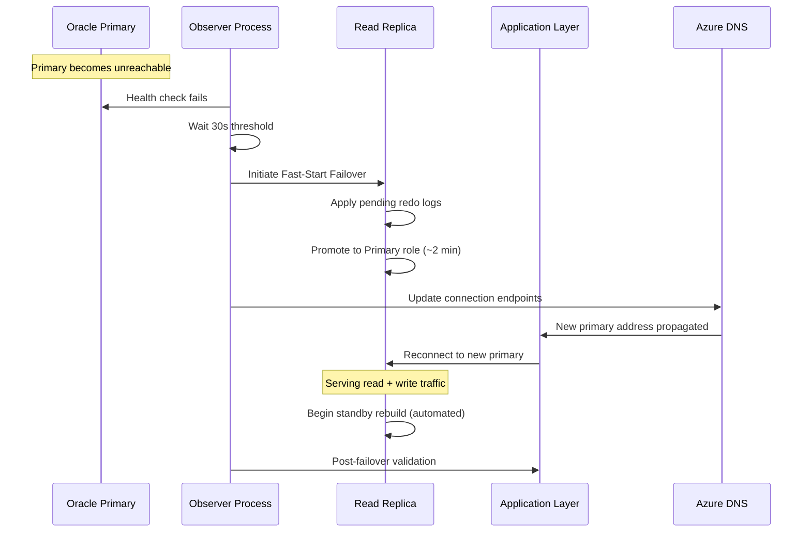

### Azure SQL (Reporting)

- **Active geo-replication** to the DR region (East US 2) with automatic failover groups.
- **Point-in-time restore** enabled with 35-day retention.
- **RPO:** <5 seconds (synchronous commit within the primary region's availability zone).

### DORIS (Clone/ETL Intermediate)

- DORIS is a transient ETL staging layer. Data loss is recoverable by re-running the ETL pipeline from Oracle.
- Daily snapshots are taken as a convenience to avoid full re-extraction during minor failures.

---

## Automated Backup & Recovery Strategy

| Component | Backup Method | Frequency | Retention | Offsite |
|-----------|--------------|-----------|-----------|---------|
| Oracle Primary | RMAN incremental + archive logs | Every 4 hours | 30 days | Geo-redundant Azure Blob (RA-GRS) |
| Azure SQL | Automated backups (Azure-managed) | Continuous (PITR) | 35 days | Geo-redundant (paired region) |
| DORIS | Volume snapshots | Daily | 7 days | Same region (recoverable via re-ETL) |
| AKS Config | GitOps (Flux) — cluster state in Git | On every change | Unlimited (Git history) | GitHub/Azure DevOps |
| Key Vault | Soft-delete + purge protection | Continuous | 90 days | Azure-managed geo-redundancy |

**Restore validation:** Automated monthly restore tests run against a non-production environment. A scheduled Azure DevOps pipeline restores the latest Oracle RMAN backup to a test instance, runs a checksum comparison on 10 key tables, and reports pass/fail to the Teams channel. Runbooks for each restore scenario are maintained in the team wiki and reviewed quarterly.

### Backup & Restore Flow

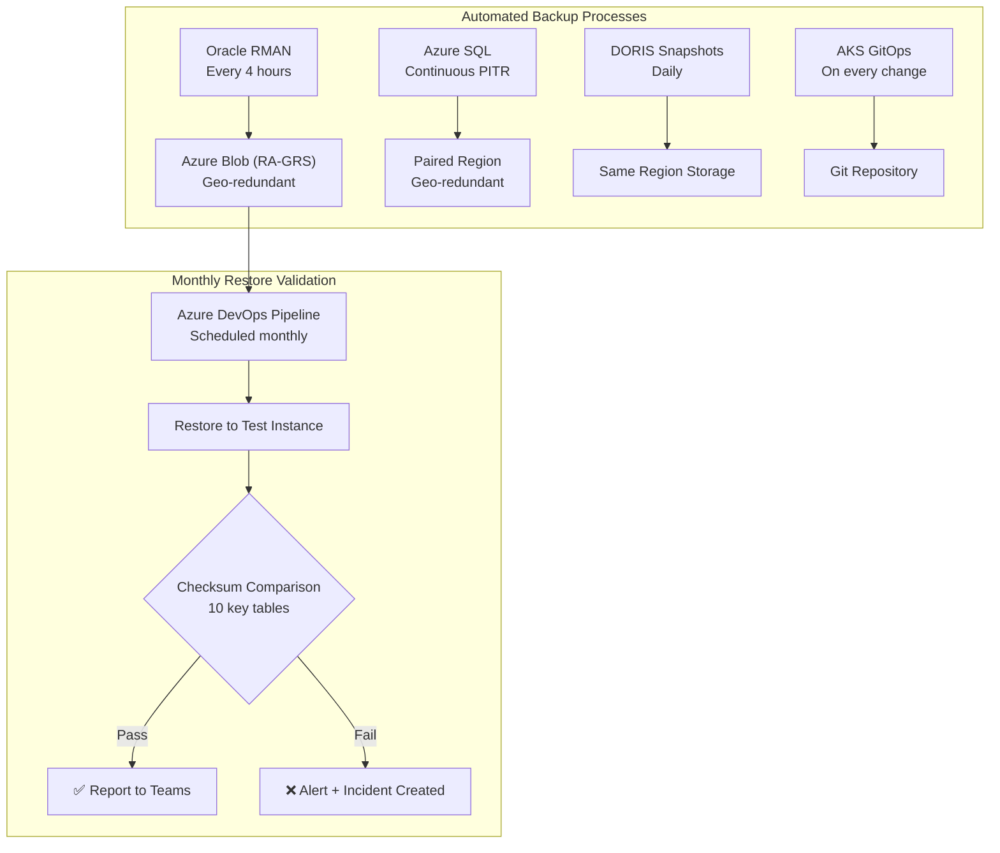

---

## Monitoring & Alerting

### Observability Architecture

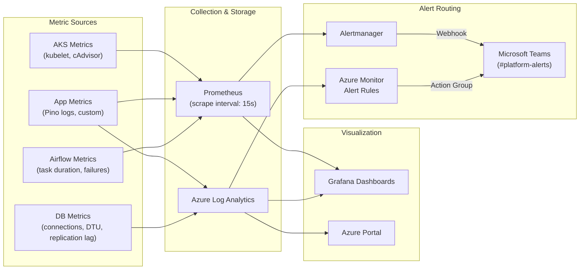

### Alert Severity Tiers

| Severity | Response | Channel | Examples |
|----------|----------|---------|----------|
| **P1 — Critical** | Immediate page to on-call | #platform-alerts + PagerDuty | Oracle replication lag >5 min, complete region failure |
| **P2 — High** | Triage during working hours | #etl-alerts | ETL job failure, pod crash loop, pipeline staleness |
| **P3 — Warning** | Review in daily standup | #platform-warnings | Elevated DTU, high memory, slow queries |

### Alert Rules

| Alert | Source | Threshold | Severity | Channel |
|-------|--------|-----------|----------|---------|
| ETL job failure | Prometheus (app metric) | Any failure status | P2 — High | #etl-alerts |
| ETL pipeline stale (no run) | Prometheus | No successful run in 30 min | P2 — High | #etl-alerts |
| Oracle replication lag | Azure Monitor | >5 minutes | P1 — Critical | #platform-alerts |
| AKS pod crash loop | Prometheus (kube-state-metrics) | >3 restarts in 10 min | P2 — High | #platform-alerts |
| Azure SQL DTU >80% | Azure Monitor | Sustained 5 min | P3 — Warning | #platform-alerts |
| Node memory >85% | Prometheus | Sustained 5 min | P3 — Warning | #platform-alerts |
| Health endpoint degraded | Prometheus (blackbox) | Any component unhealthy | P2 — High | #platform-alerts |

All alerts route to Microsoft Teams via webhook — matching Smith Farms' existing communication tooling. Critical (P1) alerts also page the on-call engineer via Azure Monitor Action Groups integrated with PagerDuty.

### Alert Routing Flowchart

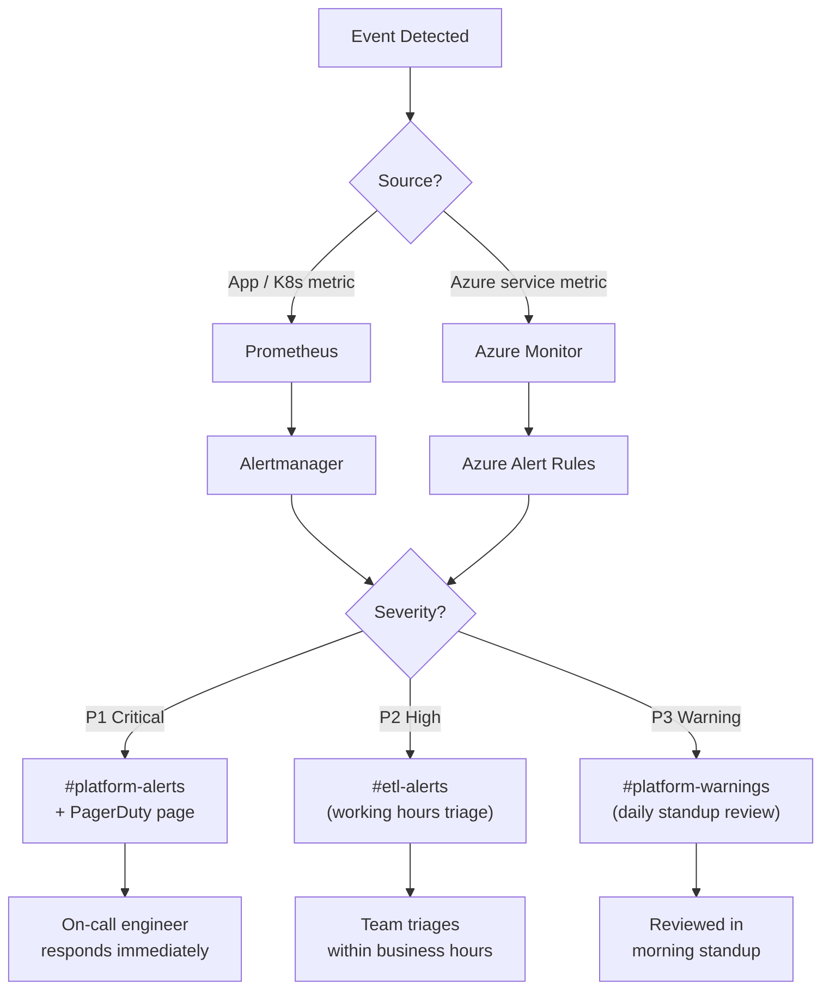

---

## Kubernetes Hardening

### Resource Management

Every pod specifies CPU and memory requests/limits to prevent noisy-neighbor issues and enable the scheduler to make informed placement decisions:

```yaml
# Example: ETL Monitor API pod
resources:
  requests:
    cpu: 250m
    memory: 256Mi
  limits:
    cpu: 1000m
    memory: 512Mi
```

A `LimitRange` on the namespace enforces defaults so no pod runs without resource boundaries. A `ResourceQuota` caps total namespace consumption to prevent runaway scaling from exhausting the node pool.

### Health Checks & Auto-Restart

| Probe | Endpoint | Interval | Failure Threshold | Purpose |
|-------|----------|----------|-------------------|---------|
| **Liveness** | `GET /health` | 10s | 3 failures | Catches deadlocked/hung processes — kubelet restarts the container |
| **Readiness** | `GET /health` | 5s | 1 failure | Removes pod from Service endpoint during startup or transient failures |
| **Startup** | `GET /health` | 30s initial delay, 10 retries | 10 failures | Gives time for migrations and warm-up without premature liveness kills |

### Pod Disruption Budgets

```yaml
apiVersion: policy/v1
kind: PodDisruptionBudget
metadata:
  name: etl-monitor-api-pdb
spec:
  minAvailable: 2
  selector:
    matchLabels:
      app: etl-monitor-api
```

Ensures at least 2 API replicas remain available during voluntary disruptions (node upgrades, scaling events).

### Auto-Scaling Strategy

| Scaler | Target | Min | Max | Trigger |
|--------|--------|-----|-----|---------|
| **HPA (API pods)** | CPU utilization 70% + request rate | 3 | 10 | Prometheus adapter custom metrics |
| **Cluster Autoscaler** | Pending pod scheduling pressure | 3 nodes | 8 nodes | Unschedulable pods |
| **KEDA (Airflow workers)** | Airflow task queue depth | 0 | 10 | Scale-to-zero during idle periods |

### Kubernetes Pod Lifecycle

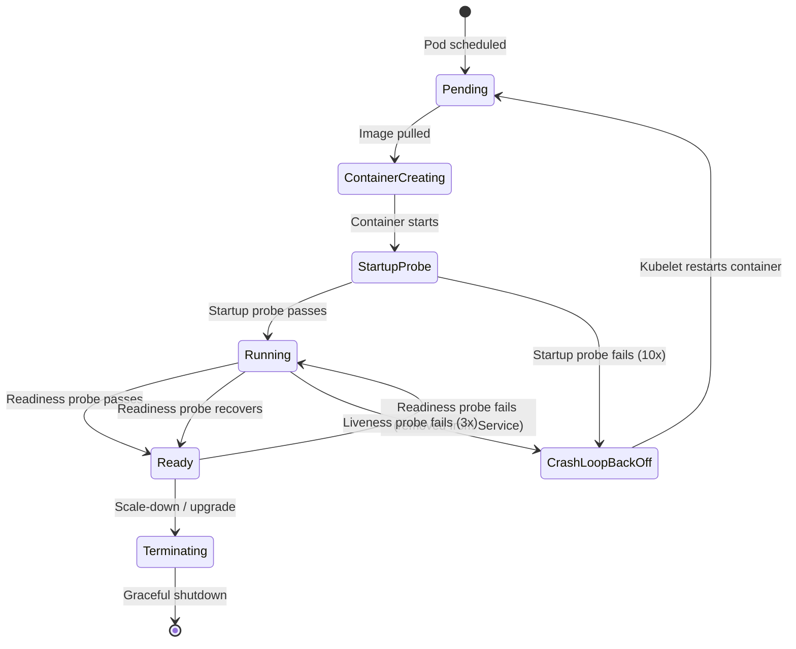

### Network Policies

Calico network policies restrict pod-to-pod traffic:

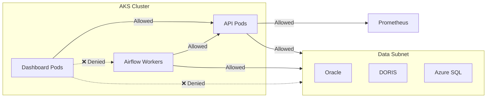

All other inter-pod traffic is denied by default.

---

## Azure VDI Session Pooling & Cost Optimization

Smith Farms operators access internal tools (Oracle Enterprise Manager, Grafana, internal dashboards) through Azure Virtual Desktop rather than exposing these services to the public internet.

### Session Pool Configuration

| Setting | Value | Rationale |
|---------|-------|-----------|
| Host pool type | Pooled | Shared hosts for cost efficiency |
| Session hosts | 4–12 (Standard_D4s_v5) | Breadth-first load balancing |
| Max sessions per host | 10 | Tuned for browser-based operator workloads |
| Idle session timeout | 30 minutes | Frees host capacity |
| Disconnected session logoff | 2 hours | Prevents orphaned sessions |
| Profile storage | FSLogix on Azure Files (Standard) | Fast login without per-host profiles |

### VDI Scaling Schedule

```mermaid
gantt
    title VDI Session Host Scaling (24-hour cycle)
    dateFormat HH:mm
    axisFormat %H:%M

    section Active Hosts
    Off-hours (2 hosts - reserved)    :a1, 00:00, 06:00
    Ramp-up (3-4 hosts)               :a2, 06:00, 08:00
    Peak hours (4-12 hosts)           :a3, 08:00, 17:00
    Ramp-down (3-4 hosts)             :a4, 17:00, 19:00
    Off-hours (2 hosts - reserved)    :a5, 19:00, 24:00
```

### Cost Optimization

| Strategy | Savings | Details |
|----------|---------|---------|
| Reserved Instances (1-year) | ~35% vs. pay-as-go | Baseline 2 hosts |
| Spot Instances | ~60-80% vs. on-demand | Burst capacity beyond baseline |
| Auto-scaling off-hours | ~40% reduction | Scale to 2 hosts 7 PM–6 AM + weekends |
| **Estimated monthly cost** | **$800–$2,000** | $800–$1,200 baseline, up to $2,000 peak |

---

## ETL Resilience

### ETL Data Flow Pipeline

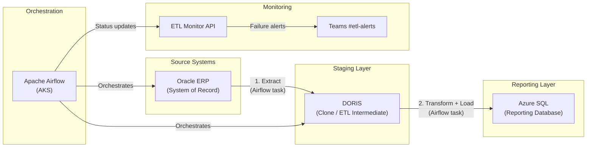

### Airflow Monitoring & Failure Detection

The ETL pipeline (Oracle → DORIS → Azure DB) is orchestrated by Apache Airflow running on AKS. Resilience is built into multiple layers:

**30-minute failure detection SLA** is achieved through three independent detection paths:

| Detection Layer | Mechanism | Detection Time | Alert Path |
|----------------|-----------|----------------|------------|
| Task-level | Airflow `execution_timeout` + StatsD → Prometheus | Seconds | Alertmanager → Teams |
| Pipeline-level | Prometheus `absent()` rule (no success in 30 min) | ≤ 30 minutes | Alertmanager → Teams |
| Application-level | ETL Monitor health endpoint staleness check | ≤ 30 minutes | Dashboard degraded warning |

### Failure Detection Flowchart

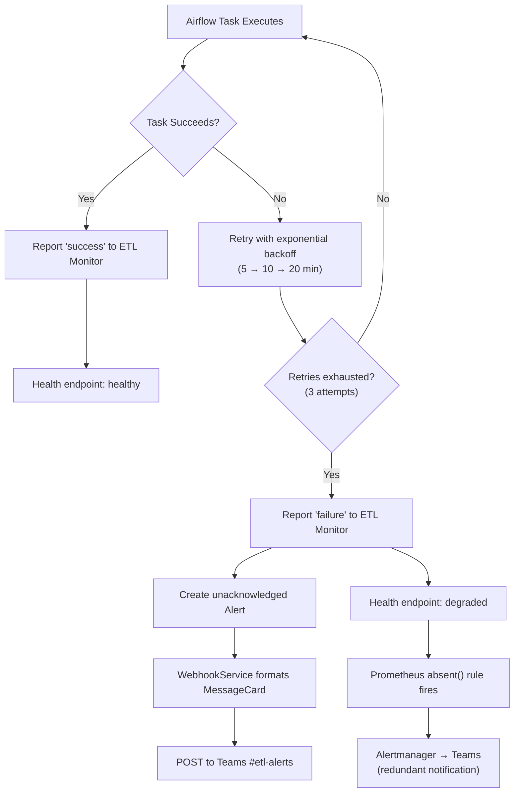

### Retry Strategy

| Parameter | Value | Notes |
|-----------|-------|-------|
| Max retries | 3 | Per Airflow task |
| Retry delay | 5 minutes (base) | Exponential backoff: 5 → 10 → 20 min |
| Execution timeout | Per-task configured | Prevents hung tasks |
| Post-retry action | Report failure to ETL Monitor | Triggers alert + Teams notification |

This layered approach ensures failures are caught even if one detection mechanism is down.

---

## Security

### Network Segmentation

The Azure Virtual Network is segmented into three subnets with NSG (Network Security Group) rules:

| Subnet | CIDR | Allowed Inbound | Allowed Outbound |
|--------|------|-----------------|------------------|
| AKS Subnet | 10.0.1.0/24 | Load Balancer (443), VDI Subnet (internal) | Data Subnet (1521, 3306, 1433), Internet (HTTPS) |
| Data Subnet | 10.0.2.0/24 | AKS Subnet only | Azure Backup, DR Region (replication) |
| Management Subnet | 10.0.3.0/24 | Corporate VPN (RDP/443) | AKS Subnet, Data Subnet |

- **Private endpoints** for Azure SQL, Key Vault, and Container Registry — no public internet exposure.
- **Azure Firewall** at the VNet egress for outbound traffic inspection and FQDN filtering.

### Access Control Model

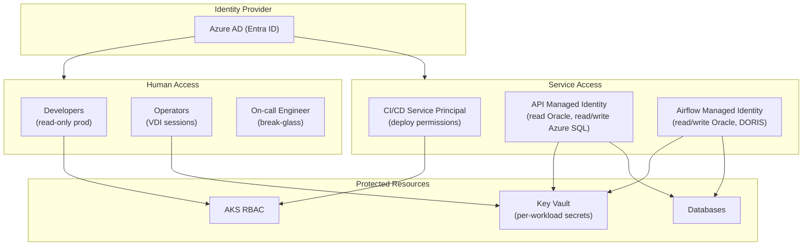

### Secrets Management (Azure Key Vault)

| Principle | Implementation |
|-----------|---------------|
| Centralized storage | All secrets in Azure Key Vault (connection strings, webhook URLs, API keys) |
| Pod access | Secrets Store CSI Driver mounts secrets as files; auto-refreshed |
| Least privilege | Each managed identity gets only the secrets it needs |
| Audit trail | All Key Vault access logged to Azure Monitor |
| No embedded credentials | Managed Identities for pod-to-Azure-service auth; no env vars or config files |

---

## Disaster Recovery Plan

### RPO/RTO Targets

| Component | RPO | RTO | Recovery Method |
|-----------|-----|-----|-----------------|
| Oracle (ERP) | ≤ 4 hours | ≤ 2 hours | Data Guard failover to DR standby |
| Azure SQL (Reporting) | ≤ 5 seconds | ≤ 30 minutes | Auto-failover group to geo-replica |
| DORIS (ETL Staging) | ≤ 24 hours | ≤ 4 hours | Re-run ETL from Oracle (data is reproducible) |
| AKS Workloads | N/A (stateless) | ≤ 30 minutes | Redeploy from GitOps repo to DR cluster |
| Key Vault | 0 (geo-redundant) | ≤ 5 minutes | Automatic (Azure-managed) |

### DR Failover Procedure

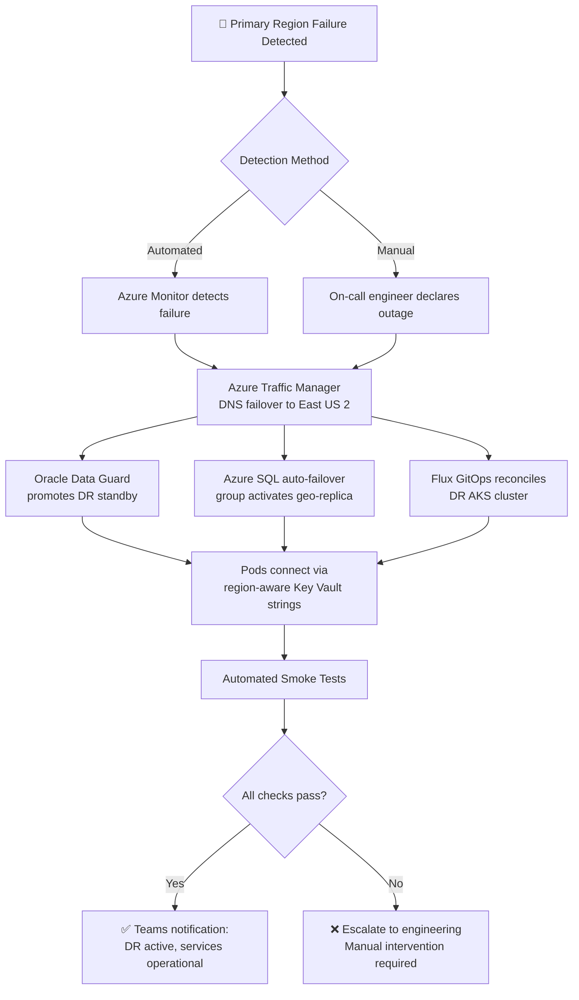

### Quarterly DR Testing

| Aspect | Details |
|--------|---------|
| Cadence | Full DR failover test every quarter; tabletop exercise in alternate quarters |
| Scope | Simulate primary region outage, execute full DR procedure |
| Success criteria | All services operational in DR within RTO; data loss within RPO; no manual intervention beyond initial declaration |
| Post-test | Retrospective with findings documented; remediation items tracked in backlog |

---

## Key Tradeoffs & Assumptions

### Design Tradeoffs

| Decision | Tradeoff | Rationale |
|----------|----------|-----------|
| **Async Oracle replication** | Small data loss window (seconds) vs. zero-loss sync | Sync adds latency to every ERP write. Batch-oriented agricultural workflows tolerate seconds of lag; RPO ≤ 4h is easily met. |
| **DORIS as recoverable staging** | No dedicated DR vs. full replication | DORIS data is derived from Oracle and regenerated by re-running ETL. Replicating adds cost without meaningful resilience gain. |
| **Dual monitoring stack** | Operational complexity vs. single-vendor simplicity | Prometheus provides deep K8s/app metrics with PromQL. Azure Monitor covers native Azure services. Grafana unifies both. Overlap is intentional. |
| **Breadth-first VDI balancing** | More active hosts vs. packing hosts full | Better per-user performance for a small operator pool (~20 users). |
| **KEDA scale-to-zero** | Cold-start latency vs. cost savings | 30–60s cold start acceptable for overnight batch ETL runs. |
| **GitOps for cluster state** | Slower emergency changes vs. reproducibility | DR cluster reconstructed identically from Git. Break-glass procedures mitigate slow emergency path. |

### Assumptions

| Assumption | Impact if Invalid |
|------------|-------------------|
| US time zones (7 PM–6 AM PT = low traffic) | Off-hours scaling would need adjustment for global operations |
| Oracle managed by existing DBA team | Would need to include primary Oracle admin in scope |
| Microsoft Teams is sole alerting channel | Alertmanager and Action Groups are extensible to Slack/PagerDuty |
| Sufficient inter-region bandwidth for replication | May need dedicated ExpressRoute circuits |
| 30-min staleness window is reliable failure signal | Maintenance windows must be annotated in Airflow to suppress false positives |