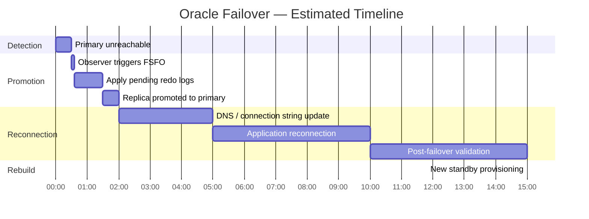
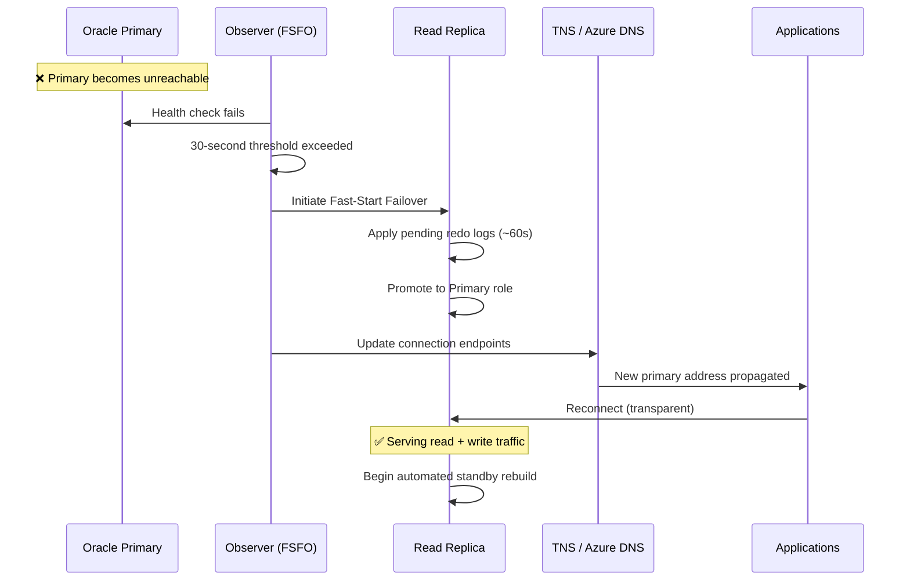
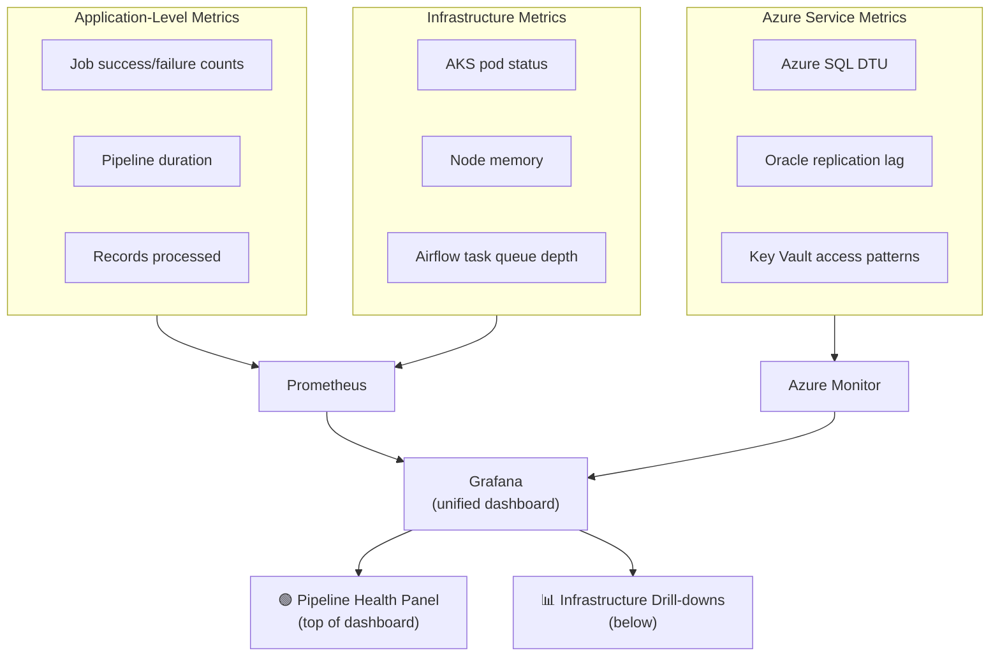
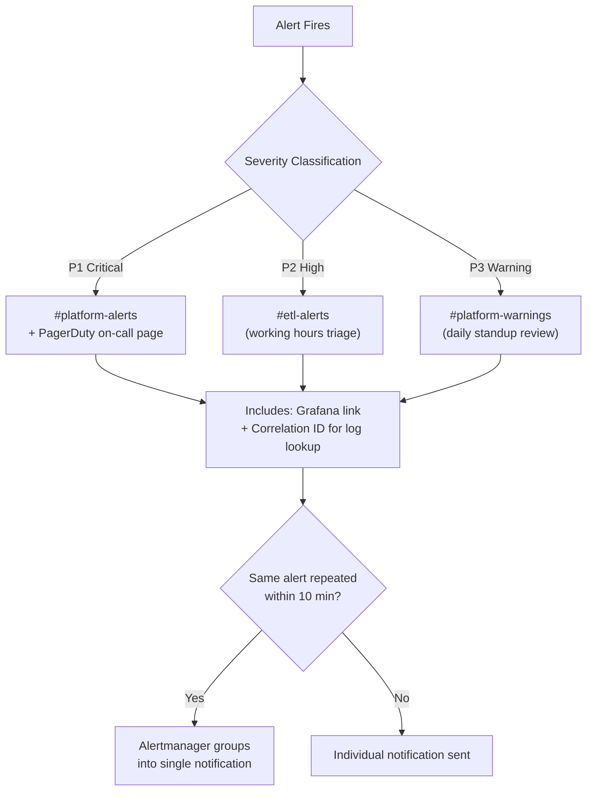
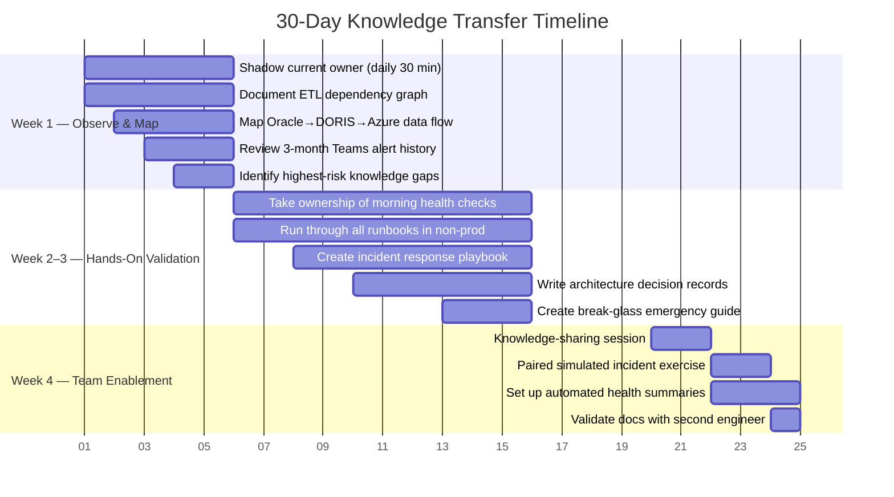
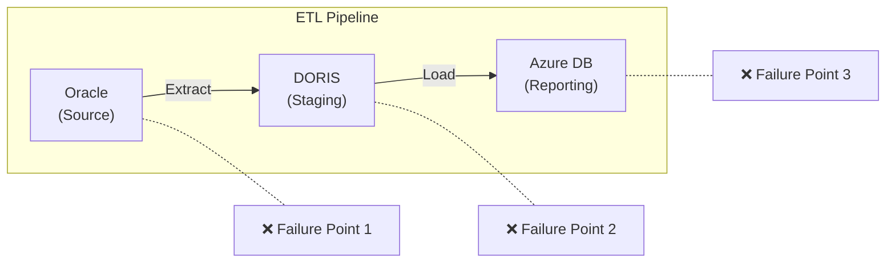
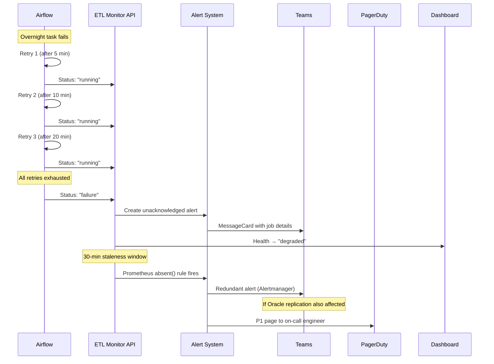

# Part 3 — Engineering Reasoning

## Smith Farms Agricultural Supply Chain Platform

---

## Table of Contents

1. [Infrastructure Resilience](#1-infrastructure-resilience)
2. [Monitoring & Incident Response](#2-monitoring--incident-response)
3. [Single-Person Dependency](#3-single-person-dependency)
4. [Failure Modes & Degradation](#4-failure-modes--degradation)

---

## 1. Infrastructure Resilience

### Oracle Read-Replica Failover: Design, Risks, and Mitigation

The Oracle read-replica failover for Smith Farms is built on Oracle Data Guard with Fast-Start Failover (FSFO). The primary Oracle instance handles all ERP write traffic, while an asynchronous read replica serves the ETL Monitor API and reporting queries. An observer process runs on a dedicated host, continuously monitoring the primary.

### Failover Timeline

### Key Risks During Transition

| Risk | Impact | Mitigation |
|------|--------|------------|
| **Async replication data loss** | Seconds of redo log lag; could widen under network degradation | Monitor replication lag as P1 metric; alert if >5 minutes. RPO ≤ 4h target met comfortably. |
| **Connection string staleness** | Applications point to old primary after promotion | Oracle TNS failover address list + Azure DNS updates; apps reconnect transparently without code changes. |
| **Single point of failure post-promotion** | New primary runs without standby until rebuild completes | Automated standby rebuild starts immediately after promotion; on-call validates within first hour. |

### Failover Sequence

### Failover Testing Strategy

Failover testing is performed quarterly during a scheduled maintenance window (Sunday 2–4 AM PT), when ETL pipelines are idle and ERP write traffic is minimal.

| Step | Action | Duration |
|------|--------|----------|
| 1 | Pause Airflow DAGs | 2 min |
| 2 | Controlled switchover (clean role reversal, no data loss) | ~5 min |
| 3 | Validate ETL Monitor health endpoint | 1 min |
| 4 | Run sample ETL job round-trip | 3 min |
| 5 | Send pre/post Teams notifications to #platform-alerts | — |
| 6 | Resume Airflow DAGs once health = healthy | 1 min |

This approach validates the failover mechanism regularly without impacting supply chain operations during business hours.

---

## 2. Monitoring & Incident Response

### Building Confidence in System Health

A monitoring strategy that gives the team real confidence starts with answering one question clearly: **"Is data flowing?"** For Smith Farms, that means tracking ETL pipeline completion as the top-level health signal. If the `oracle-inventory-sync`, `doris-sales-etl`, and `azure-reporting-load` pipelines are completing on schedule with expected record counts, the system is healthy. Everything else — pod CPU, database connections, replication lag — is supporting detail.

### Monitoring Stack Architecture

### Metric Priority Matrix

| Priority | Metric | Why It Matters | Threshold | Action |
|----------|--------|----------------|-----------|--------|
| 🔴 **1** | ETL pipeline completion rate | Any failure = data not flowing to reporting | Any failure | Immediate triage |
| 🟠 **2** | Pipeline staleness | Something stuck even if nothing explicitly failed | No success in 30 min | Investigate Airflow |
| 🟡 **3** | Oracle replication lag | Read replica serving stale data to reporting | >5 minutes | Check network / primary load |
| 🔵 **4** | AKS pod restart count | Crash loops = app bugs or resource exhaustion | >3 restarts in 10 min | Check logs + resource limits |
| ⚪ **5** | Azure SQL DTU utilization | Reporting layer under pressure, queries degrade | Sustained >80% for 5 min | Scale up or optimize queries |

These five metrics cover the critical path from data ingestion through transformation to reporting.

### Alert Routing & Fatigue Prevention

Alert routing is where most teams get fatigue wrong — they alert on everything and route it all to the same channel. We avoid this by tiering alerts and separating channels. Every alert includes a direct link to the relevant Grafana dashboard panel and the correlation ID for log lookup. Alertmanager groups repeated alerts (e.g., same pipeline fails 5 times in 10 minutes → one grouped notification, not five). This keeps the signal-to-noise ratio high.

---

## 3. Single-Person Dependency

### First 30 Days: Knowledge Absorption and Operational Resilience

### 30-Day Knowledge Transfer Plan

### Week-by-Week Breakdown

| Week | Focus | Key Activities | Deliverables |
|------|-------|----------------|--------------|
| **Week 1** | Observe & Map | Shadow current owner, document ETL dependency graph, map data flows, review 3-month alert history | Knowledge gap inventory, system map wiki page |
| **Week 2–3** | Hands-On Validation | Own morning health checks (with backup), run all runbooks in non-prod, update outdated steps | Incident response playbook (top 5 scenarios), ADRs for key design choices, break-glass guide |
| **Week 4** | Team Enablement | Knowledge-sharing session, paired simulated incident, set up automated daily/weekly reports | Team can diagnose + resolve issues from docs alone |

### Critical Documents to Produce

| Document | Purpose | Contents |
|----------|---------|----------|
| **Incident Response Playbook** | Step-by-step resolution for top 5 failure scenarios | Symptoms → diagnosis → resolution → verification for each scenario |
| **Architecture Decision Records (ADRs)** | Capture *why* key design choices were made | Why async replication, why DORIS staging, why specific Airflow retry settings |
| **Break-Glass Guide** | Emergency access and manual overrides | Credentials, escalation paths, manual failover steps, rollback procedures |

The measure of success isn't that one person has absorbed all the knowledge — it's that the knowledge now lives in documentation, dashboards, and runbooks that any engineer on the team can follow.

---

## 4. Failure Modes & Degradation

### Overnight ETL Pipeline Failure: Blast Radius and Expected Behavior

If the Oracle → DORIS → Azure DB ETL pipeline fails overnight, the blast radius depends on where in the chain the failure occurs.

### Blast Radius by Failure Point

| Failure Point | What Breaks | What Still Works | Recovery |
|---------------|-------------|------------------|----------|
| **Oracle → DORIS extraction fails** | DORIS has stale data; Azure DB reports show yesterday's numbers | Oracle primary + read replica operational; ETL Monitor API has visibility | Re-run extraction once Oracle is accessible |
| **DORIS → Azure DB load fails** | Azure DB is stale | DORIS has current data; Oracle unaffected | Re-run just the load step (faster recovery) |
| **Oracle itself is down** | Entire chain stalls | Read replica may still serve recent data for status visibility | Wait for Oracle recovery or Data Guard failover |
| **Silent failure (0 records / corrupt data)** | Pipeline appears to succeed but data is wrong | All systems "healthy" — most dangerous scenario | `recordsProcessed` metric alerts if count is significantly below historical average |

### Expected System Behavior During Overnight Failure

### Morning Triage — What the Team Sees

When the team arrives in the morning, they should see a clear picture without needing to investigate:

| Where to Look | What They See |
|----------------|---------------|
| **ETL Monitor Dashboard** | Health status: "degraded", Airflow component flagged unhealthy |
| **Job List** | Failed pipeline's last run highlighted in red with unacknowledged alert badge |
| **Job Detail** | Error message, duration, timestamp of last attempt, retry history |
| **Teams #etl-alerts** | MessageCard with failure details + Grafana dashboard link |
| **PagerDuty log** | Whether P1 was triggered (Oracle replication affected) or just P2 (isolated pipeline failure) |

The team can immediately assess: what failed, when it failed, how many retries were attempted, what the error was, and whether the failure is isolated or part of a broader infrastructure issue — all without running a single manual query.